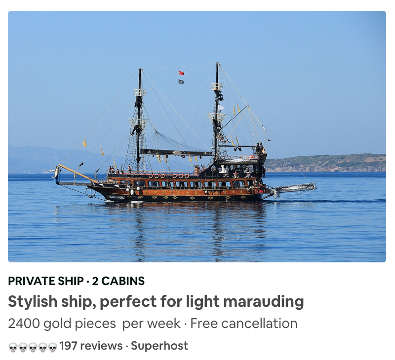

# :ocean::ocean: Pirates-BNB (Board 'n Booty) :ocean::ocean:

# Description
Create a web application that allows pirates to list ships for rental to landlubbers (me 'earties!).

# MVP 

A pirate should be able to name their ship, provide a short description of the ship (rigging, sails etc.) and the price per week. This information should be visible to landlubbers wishing to hire a ship.(see attached image for example from AirBNB)

## User Stories

   As a pirate  
   So that I can advertise my ships,    
   I want to be able to create a listing.  

   As a pirate  
   So that I can get my gold  
   My ships should each have a price  

   As a pirate  
   So that people choose my ships  
   My ships should have a description  

   As a landlubber  
   So that I can choose a ship  
   I want to be able to see the available ship  

   As a landlubber  
   So that I can adjust for my budget  
   I want to be able to see the gold for each one  

   As a landlubber  
   So that I can make an informed decision  
   I want to be able to see the skull rating.  

   As a landlubber with a crew  
   So that all my friends can loot with me,  
   I want to be able to see the capacity of each ship.  

## Tech Stack
* Javascript model
  * Testing with Jasmine
* PG for database management.
* Sinatra Controller
  * Capybara Feature Testing
* HTML/JQuery views

### Contributors
* [Fred Hollis](https://github.com/archmagos)
* [Nabil Far](https://github.com/bilfar)
* [Daniel Lau](https://github.com/dct-lau17)
* [John Forster](https://github.com/JohnForster)
