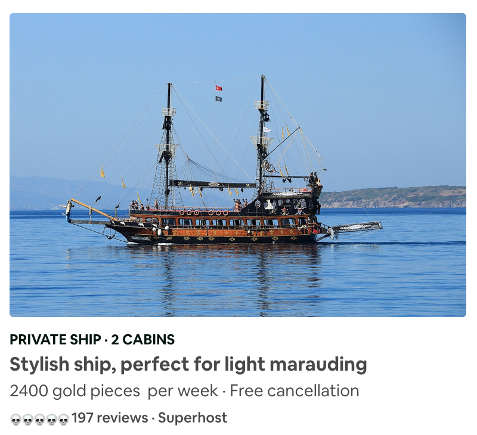

# :ocean::ocean: Pirates-BNB (Board 'n Booty) :ocean::ocean:

## Description
Create a web application that allows pirates to list ships for rental to landlubbers (me 'earties!).

## Motivation and goals
* To work together as a dev team apply XP values
* To effectively communicate in a team
* To apply and further our Javascript knowledge on a web application


## MVP 

A pirate should be able to name their ship, provide a short description of the ship (rigging, sails etc.) and the price per week. This information should be visible to landlubbers wishing to hire a ship (see attached image for example).

### User Stories

   As a pirate  
   So that I can advertise my ships,    
   I want to be able to create a listing.  

   As a pirate  
   So that I can get my gold  
   My ships should each have a price  

   As a pirate  
   So that people choose my ships  
   My ships should have a description  

   As a landlubber  
   So that I can choose a ship  
   I want to be able to see the available ship  

   As a landlubber  
   So that I can adjust for my budget  
   I want to be able to see the gold for each one  

   As a landlubber  
   So that I can make an informed decision  
   I want to be able to see the skull rating.  

   As a landlubber with a crew  
   So that all my friends can loot with me,  
   I want to be able to see the capacity of each ship.  

## Tech Stack
* Javascript model
  * Testing with Jasmine
* Express Controller for front-end.
* PG for database management.
* Sinatra Controller for database management.
  * Cypress for Feature Testing
* HTML/JQuery views

## Implementation
* Build a database on your local machine: `rake build`  
* Install node, navigate to \_Express and run: `npm install`  
* To run the front-end Express server, navigate to \_Express and run: `npm start`  
* Run the back-end server, open a new terminal, navigate to \_Sinatra and run: `rackup`  
* The control panel can be accessed on 'http://localhost:3000'

## Testing

Back End Server Tests:
```
# In the _Sinatra directory run:
rspec
```

Front End  Server Tests:

```
# In the _Express directory:
npm install cypress
npm start

# On a new terminal in the _Sinatra directory:
Rackup

# In the _Express directory:
./node_modules/.bin/cypress open
```
## Nice-to-haves
Given we only had a 4 day time frame to do this project, we were only able to complete our MVP and add a basic booking system.

If we had more time we would love to have implemented the following features:
- Sign up and log in
- A user can request a booking
- Ability to select dates for booking on a calendar

### Contributors
* [Fred H](https://github.com/archmagos)
* [Nabil Far](https://github.com/bilfar)
* [Daniel Lau](https://github.com/dct-lau17)
* [John Forster](https://github.com/JohnForster)
